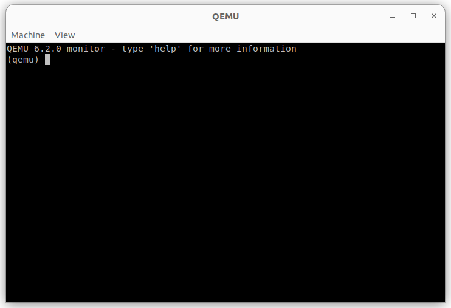
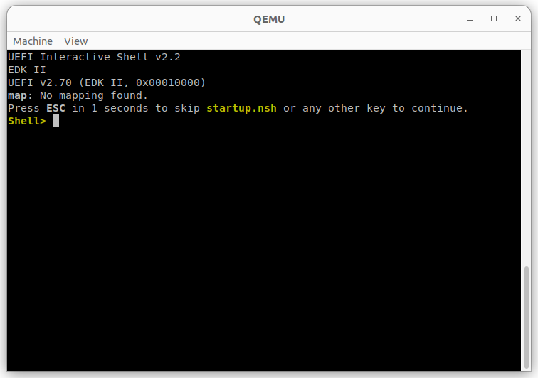
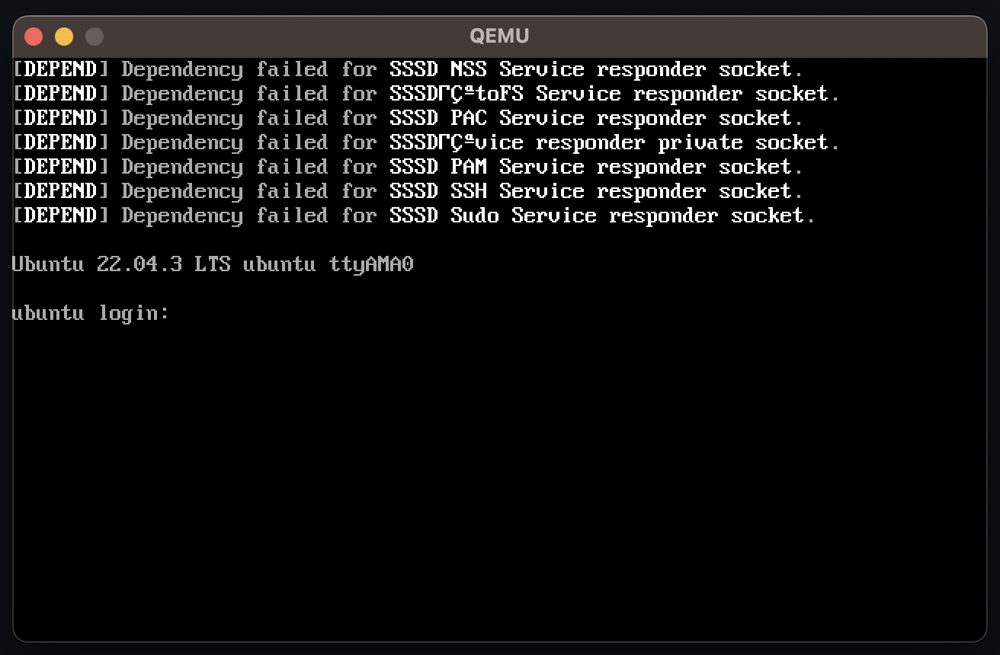
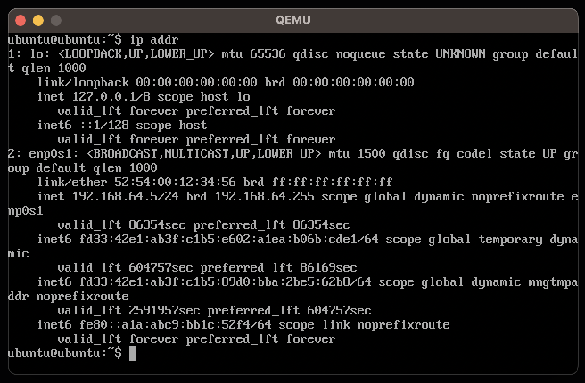
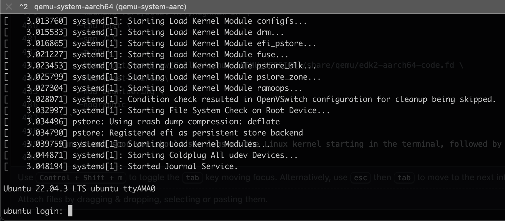

\[ **macOS/ARM64** | [Linux/AMD64](../../linux/docs/01_Learning_How_to_Run_VMs_with_QEMU.md) \]

Previous: [Introduction](00_Introduction.md)

# Learning How to Run VMs with QEMU

Let's learn how to launch virtual machines.

In a real-world scenario, virtual machines would be managed by a high-level tool like [Vagrant](https://www.vagrantup.com/).
However, we want to do things _the hard way_ in this guide, in order to see the guts of all the layers 
involved. Because of that, we will use perhaps the most _raw_ tool out there for running VMs: [QEMU](https://www.qemu.org/).

This chapter is an introduction to virtualization in general, exploration of QEMU, plus an overview of the `cloud-init` 
tool. None of the actions in this chapter are necessary to progress with the deployment, they are intended purely 
for learning. You may jump straight into the [next chapter](02_Preparing_Environment_for_a_VM_Cluster.md) if you wish.

<!-- START doctoc generated TOC please keep comment here to allow auto update -->
<!-- DON'T EDIT THIS SECTION, INSTEAD RE-RUN doctoc TO UPDATE -->
**Table of Contents**  *generated with [DocToc](https://github.com/thlorenz/doctoc)*

  - [Prerequisites](#prerequisites)
- [Introduction to QEMU and virtualization](#introduction-to-qemu-and-virtualization)
  - [Hardware-assisted virtualization](#hardware-assisted-virtualization)
  - [QEMU, virtualization and paravirtualization](#qemu-virtualization-and-paravirtualization)
  - [Starting a VM with QEMU](#starting-a-vm-with-qemu)
  - [Starting QEMU _the hard way_](#starting-qemu-_the-hard-way_)
  - [UEFI](#uefi)
- [Running a Ubuntu Live CD](#running-a-ubuntu-live-cd)
  - [Adding a network](#adding-a-network)
  - [Graphics and peripherals](#graphics-and-peripherals)
  - [Disk drive](#disk-drive)
- [Running a cloud image](#running-a-cloud-image)
  - [The cloud image](#the-cloud-image)
  - [QCOW2 images](#qcow2-images)
  - [Running a headless VM](#running-a-headless-vm)
  - [`cloud-init`](#cloud-init)
- [Summary](#summary)
- [Resources](#resources)

<!-- END doctoc generated TOC please keep comment here to allow auto update -->

### Prerequisites

Make sure you have all the necessary [packages](00_Introduction.md#software) installed.

## Introduction to QEMU and virtualization

QEMU stands for _Quick Emulator_. It's an open source, command-line tool originally written by Fabrice Bellard in 2003. 
As its name suggests, it is primarily an _emulator_.
It can emulate a physical computer with wide variety of physical devices, including CPUs of many architectures, network cards from many
vendors, disks, flash drives, etc. Crafting a QEMU command is like building an actual computer from real hardware components.

This is very powerful - it allows us to test software written for all sorts of CPU architectures and devices without actual physical access to these devices.
However, _emulation_ means "translation on the fly" and is done in userspace, which makes it slow. Besides, testing device drivers is not our use case anyway. 
We don't care about simulating some specific vendor's hardware or CPU architecture, we only want to run a bunch of Linux VMs, with lowest possible overhead.
In other words, we want _virtualization_ rather than _emulation_.

Fortunately, virtualization isn't that far from emulation. In fact, we only need to virtualize performance-critical hardware like CPU while all the
non-performance-critical devices can be emulated. Actual virtualization is done by the _hypervisor_, a piece of software typically implemented by the host operating system.
The standard kernel-level hypervisor for Linux is [KVM](https://en.wikipedia.org/wiki/Kernel-based_Virtual_Machine) and for macOS, it is [HVF](https://developer.apple.com/documentation/hypervisor).
However, in order to make virtualization _fast_, a hypervisor is not enough, virtualization must also be supported by the hardware itself.

Hence the [hardware-assisted virtualization](https://en.wikipedia.org/wiki/Hardware-assisted_virtualization).

### Hardware-assisted virtualization

Hardware-assisted virtualization is implemented by the host CPU. The details differ between Intel/AMD, Apple Silicon and other architectures, but usually it consists of
a set of special CPU instructions and data structures that allow the hypervisor to make the CPU aware that it is currently running a virtual machine. This way the CPU
knows that, at certain moments (instructions), it needs to return the control back to the hypervisor. For example, when the VM wants to perform an IO operation, the CPU
cannot simply execute it on host hardware. It must give the control back to the hypervisor so that this operation can be emulated on virtual hardware.

A key part of hardware-assisted virtualization is also a [second layer of memory address translation](https://en.wikipedia.org/wiki/Second_Level_Address_Translation) which
translates between VM's virtual memory and host's virtual memory. Without it, the hypervisor would have to translate or intercept every single memory access instruction.

As a result of this hardware-level support, most of the VM code can run directly on the underlying CPU, without the need for intermediate translation or inspection
of every instruction by the hypervisor.
Naturally, this requires that the guest system uses the same CPU architecture as the host CPU.

### QEMU, virtualization and paravirtualization

QEMU, despite being originally an emulator, integrates with hypervisors and therefore supports hardware-accelerated virtualization. As we'll see soon, enabling it
is just a matter of passing a certain command line option. That's great! It means we can run our Linux VMs with QEMU almost as fast as natively.

There's also another nuance worth mentioning: a technique called _paravirtualization_. It is a "weaker" form of virtualization where the guest system is aware that
it is being virtualized. This allows simpler communication between the guest machine and the hypervisor, e.g. when the VM is doing IO operations. In practice, this means
that QEMU no longer needs to emulate some specific vendor's hardware for, say, a network card. Instead, it can expose a "virtio" network card. You can think of it as
a network card that's being "honest" about being virtualized instead of pretending to be some physically existing hardware. This simplifies things at the cost of
the guest system needing additional drivers for these virtio devices. Fortunately, Linux supports them well so we can take full advantage of paravirtualization.

### Starting a VM with QEMU

Try running QEMU with this bare-bones command:

```
qemu-system-aarch64 \
    -machine virt,accel=hvf \
    -cpu host
```

* `-machine virt` specifies a type of a machine - we have no interest in emulating a specific hardware so we just use the special type `virt`
* the `accel=hvf` part is the important one: it enables hardware acceleration using macOS Hypervisor Framework
* `-cpu host` specifies that the guest machine will see exactly the same CPU model as the host machine (required for acceleration)

Note that we haven't specified any drives yet, and as a result, there's no operating system to boot.
What we're currently simulating is like a bare-bones computer without any hard drive or CDROM plugged in.

You should see a window with the QEMU monitor console:



There isn't anything particularly interesting about it, but it's a good opportunity to learn some basic QEMU controls. 
The console itself gives a bunch of [commands](https://en.wikibooks.org/wiki/QEMU/Monitor) for things like stopping or resuming a running VM.

What might not be apparent, though, is that this window has other "tabs" (terminals). Try hitting `Ctrl`+`Opt`+`2` or `Ctrl`+`Opt`+`3` and you should
see the output of serial and parallel ports. This is where we're going to see our operating system running. You can always go back to
the monitor console with `Ctrl`+`Opt`+`1`.

> [!NOTE]
> If you click on the QEMU window, it will capture your mouse. Hit `Ctrl`+`Opt`+`G` to release it.

In order to kill the machine, type `quit` into the console, close the window or kill the process from the terminal.

### Starting QEMU _the hard way_

Wait, what? Even harder?

Yes! Even a raw tool like QEMU provides some nice defaults. In the previous run, QEMU automatically created at least three devices:

* the monitor console (pseudo-device)
* a serial port
* a parallel port

Just to see what's really going on and have full control, we will turn off these defaults and create these devices manually
(monitor console and serial port, we'll ignore the parallel port). We achieve this with the following command:

```
qemu-system-aarch64 \
    -nodefaults \
    -machine virt,accel=hvf \
    -cpu host \
    -chardev vc,id=monitor \
    -mon monitor \
    -serial vc
```

* `-nodefaults` makes sure we have to do everything by hand
* the `-chardev` option creates a host-side "backend" for character devices
* `vc` indicates the QEMU text console (e.g. the one in the QEMU window) and probably stands for "virtual console"
* `monitor` is an arbitrary id assigned to this character device
* `-mon monitor` creates a monitor console that uses `monitor` as its backend
* `-serial vc` creates a virtual serial port device that also uses QEMU text console

### UEFI

In order to start an operating system, we are first going to need something to boot it up, i.e. a BIOS or UEFI, on an emulated, read-only flash drive.
QEMU uses BIOS by default. However, it is obsolete and won't work on an Apple Silicon CPU. We'll need to plug in an UEFI flash drive instead.

QEMU comes with bundled, open source impelementation of UEFI firmware called OVMF (Open Virtual Machine Firmware), which is a port of
proprietary Intel UEFI implementation (TianoCore). If you installed QEMU with Homebrew, you should be able to find it in this location:

```
/opt/homebrew/share/qemu/edk2-aarch64-code.fd
```

The simplest QEMU option to mount OVMF file as a BIOS/UEFI is:

```
-bios /opt/homebrew/share/qemu/edk2-aarch64-code.fd
```

However, we can be a little more explicit:

```
-drive if=pflash,readonly=on,format=raw,file=/opt/homebrew/share/qemu/edk2-aarch64-code.fd
```

This is a common situation in QEMU - we can use very raw and detailed options and wire every device manually,
or we can use some convenient shorthands. Since we're doing things _the hard way_, I try to show the most low-level
version possible, but as our command grows new options, we don't want it to become too bloated, so let's go back and use
the shorthand:

```
qemu-system-aarch64 \
    -nodefaults \
    -machine virt,accel=hvf \
    -cpu host \
    -chardev vc,id=monitor \
    -mon monitor \
    -serial vc \
    -bios /opt/homebrew/share/qemu/edk2-aarch64-code.fd
```

Now if you go to the serial console (using `Ctrl`+`Opt`+`2` in the QEMU window), you should see the UEFI running:



We haven't provided any drive with an actual operating system though, so nothing boots up and UEFI defaults to a console.

> [!NOTE]
> Usually, along with the UEFI firmware itself, another, writable flash drive is mounted for UEFI _variables_,
> i.e. user-editable UEFI settings. Since we don't plan to modify these settings, we'll omit this drive.

## Running a Ubuntu Live CD

So far we have a VM with a monitor console, serial console and a UEFI flash drive. Let's add a CDROM drive with a Live CD Ubuntu
distribution to finally have a working operating system!

Let's download a Live CD image for Ubuntu Jammy:

```
wget https://cdimage.ubuntu.com/jammy/daily-live/current/jammy-desktop-arm64.iso
```

The shortest option to mount it as a CD-ROM is:

```
-cdrom jammy-desktop-arm64.iso
```

which has a longer version:

```
-drive file=jammy-desktop-arm64.iso,index=2,media=cdrom
```

...which can be further split into a separate "backend" (`-blockdev`) and "frontend" (`-device`):

```
-blockdev node-name=cdrom,driver=file,read-only=on,filename=jammy-desktop-arm64.iso \
-device virtio-blk-pci,drive=cdrom
```

Again, we will use the simplest version.

But before we run the machine, we also need to give it some resources.
By default, QEMU will allocate a very small amount of RAM (e.g. 128MB) which is certainly not enough to run an
everyday Linux distribution.

Let's give it 2GB for a start. An option for that is:

```
-m 2G
```

We will also add a `highmem=on` property for the `-machine` option so that we can increase the amount of physical memory
to over 4GB in the future.

This is also a good moment to explicitly assign the number of virtual CPUs to our VM. Let's give it 2 CPUs:

```
-smp 2
```

> [!NOTE]
> `smp` stands for [_symmetric multiprocessing_](https://en.wikipedia.org/wiki/Symmetric_multiprocessing)

> [!NOTE]
> These CPUs do not necessarily map directly to host CPUs. There is a scheduling algorithm involved
> between the host and guest CPUs. It is even possible for a VM to have more CPUs than there are present on the
> host machine.

Ultimately we end up with this command:

```
qemu-system-aarch64 \
    -nodefaults \
    -machine virt,accel=hvf,highmem=on \
    -cpu host \
    -smp 2 \
    -m 2G \
    -chardev vc,id=monitor \
    -mon monitor \
    -serial vc \
    -bios /opt/homebrew/share/qemu/edk2-aarch64-code.fd \
    -cdrom jammy-desktop-arm64.iso
```

If you now go to the serial console (using `Ctrl`+`Opt`+`2` in the QEMU window), you'll see that UEFI has picked up the 
new drive and detected a system on it:


Hit enter and launch the system. Soon you should see a login screen:



Log in as `ubuntu` and you're in.

Congratulations! You've successfully run a Linux distribution using raw QEMU.

### Adding a network

The machine we have built has no network access. Let's change that.

There are several ways QEMU can emulate a network interface. They can roughly be split into two categories:
* userspace backends - usually slow and limited but available on all host OSes
* native backends - implemented by host OSes and their hypervisors, usually fast but OS-dependent and may require escalated privileges

Some of the most commonly used network backends are:

* `user` is an userspace implemented network ([SLIRP](https://en.wikipedia.org/wiki/Slirp)) between the host and guest OS.
  Allows the guest to access the guest machine to communicate with the host, and provides internet access to the guest.
  Unfortunately, guest machine is not addressable from the host machine in this mode. It also has poor performance, being implemented
  in userspace. For these reasons we will not be using it. It is however worth mentioning because it is the default network
  backend that QEMU sets up if we don't configure one (and provided that we don't use `-nodefaults`).

* `tap` creates a virtual layer 2 network interface on the host machine connected to the guest machine. This is versatile and
   has good performance, but generally requires root privileges. Unfortunately, macOS does not currently support it so we won't be able
   to use it in this tutorial.

* `bridge` connects the VM to a network bridge that needs to be previously set up on the host machine and connected to one
  of host's native interfaces. This effectively makes the VM appear in the same network that the host machine lives in, making it
  visible to the external world. The VM will then typically get configured by the same DHCP server as the host machine
  (e.g. your home router). Unfortunately, this exact mode is not available on macOS either, but it has a macOS specific equivalent
  called `vmnet-bridged`.

There are many more modes which we will not cover here. We are on macOS, which provides three additional modes implemented
by its `vmnet` framework:

* `vmnet-host` - a host-only network that allows the guest to communicate with the host but without internet access
* `vmnet-shared` - allows the guest to communicate with the host and provides it with internet access via NAT
* `vmnet-bridged` - just like `bridge` mode, connects the VM to a layer 2 bridge, but the bridge itself is set up automatically

When using these modes, macOS also automatically configures its built-in DHCP server and starts a DNS server so that the VM
can have a properly configured network.
  
In this guide we'll always use the `vmnet-shared` network backend. Let's enable it with the following option:

```
-nic vmnet-shared
```

A longer version (with separate "backend" and "frontend") would be:

```
-netdev vmnet-shared,id=net0 \
-device virtio-net-pci,netdev=net0
```

These options can be refined with additional properties, e.g. we can choose the IP address range for shared network and
decide to isolate it from other VMs. We can also manually assign a MAC address to the guest VM. We will use some of these
options later, when setting up an actual Kubernetes machine.

Unfortunately, usage of `vmnet` requires escalated privileges on macOS, so from now on we must run QEMU using `sudo`:

```
sudo qemu-system-aarch64 \
    -nodefaults \
    -machine virt,accel=hvf,highmem=on \
    -cpu host \
    -smp 2 \
    -m 2G \
    -chardev vc,id=monitor \
    -mon monitor \
    -serial vc \
    -bios /opt/homebrew/share/qemu/edk2-aarch64-code.fd \
    -cdrom jammy-desktop-arm64.iso \
    -nic vmnet-shared
```

Let's log into Ubuntu and run the `ip addr` command. We can see a new virtual ethernet interface with a nicely
assigned IP address:



You can also run `ping google.com` to confirm internet access.

### Graphics and peripherals

Ubuntu on Live CD is a graphical distribution. It would be nice to see a proper graphical output, hear some sounds and be
able to work with mouse and keyboard in a graphical shell. We're not going to need any of this for our Kubernetes deployment
so I will not explain all the QEMU options in detail, but for the sake of completeness, this is the full command that runs
our VM with support for all these devices:

```
sudo qemu-system-aarch64 \
    -nodefaults \
    -machine virt,accel=hvf,highmem=on \
    -cpu host \
    -smp 2 \
    -m 2G \
    -chardev vc,id=monitor \
    -mon monitor \
    -serial vc \
    -bios /opt/homebrew/share/qemu/edk2-aarch64-code.fd \
    -cdrom jammy-desktop-arm64.iso \
    -nic vmnet-shared \
    -device virtio-gpu-pci \
    -display cocoa,show-cursor=on \
    -device nec-usb-xhci \
    -device usb-mouse \
    -device usb-tablet \
    -device usb-kbd \
    -audiodev coreaudio,id=audio0 \
    -device ich9-intel-hda \
    -device hda-output,audiodev=audio0
```

And here it is running:


### Disk drive

The final missing piece for our system to be fully functional is a disk drive. We could use it to install Ubuntu from Live CD
distribution, just like on a physical machine.

A disk drive will be backed by a file on a host machine. There are many formats for disk images. One of the most commonly used
in QEMU is QCOW2, which stands for _QEMU Copy On Write version 2_. We'll explain what that means later. For now let's 
just create an image file with maximum size of 128GB. This can be done with `qemu-img` utility:

```
qemu-img create -f qcow2 ubuntu.img 128G
```

> [!NOTE] 
> The image won't immediately take 128GB of your disk. It grows dynamically, as more space is requested by the VM.

Now, mounting this file as a drive to a VM is as simple as:

```
-hda ubuntu.img
```

Unsurprisingly, this is a shorthand for something more verbose:

```
-drive file=ubuntu.img,index=0,media=disk
```

...or even longer:

```
-blockdev node-name=disk,driver=qcow2,file.driver=file,file.filename=ubuntu.img \
-device virtio-blk-pci,drive=disk
```

And the full command:

```
sudo qemu-system-aarch64 \
    -nodefaults \
    -machine virt,accel=hvf,highmem=on \
    -cpu host \
    -smp 2 \
    -m 2G \
    -chardev vc,id=monitor \
    -mon monitor \
    -serial vc \
    -bios /opt/homebrew/share/qemu/edk2-aarch64-code.fd \
    -cdrom jammy-desktop-arm64.iso \
    -nic vmnet-shared \
    -hda ubuntu.img \
    -device virtio-gpu-pci \
    -display cocoa,show-cursor=on \
    -device nec-usb-xhci \
    -device usb-mouse \
    -device usb-tablet \
    -device usb-kbd \
    -audiodev coreaudio,id=audio0 \
    -device ich9-intel-hda \
    -device hda-output,audiodev=audio0
```

Now you can install your Ubuntu on this drive. After you do that, you can remove the CDROM device and image and
work with the system on a disk. This is what you would typically do with a desktop-like virtual machine.
However, for our ultimate goal - a working Kubernetes deployment - we will take a different route.

## Running a cloud image

We're done with the Live CD distribution. It was nice for playing with QEMU, but now we're taking a step back
in order to prepare a more server-like distribution. Here's what's going to change:

* instead of using a Live CD image, we will use a _cloud image_
* the server will run headless, so no graphics or peripherals
* we will run the VM entirely in terminal (no QEMU window)

### The cloud image

Cloud image is a disk image with a preinstalled Ubuntu distribution. It is optimized for server usage (headless) and
requires some additional, automated preconfiguration (e.g. to set up remote SSH access).

Let's download a Jammy cloud image for AArch64:

```
wget https://cloud-images.ubuntu.com/jammy/current/jammy-server-cloudimg-arm64.img
```

This file is in QCOW2 format.

### QCOW2 images

As already mentioned, QCOW2 stands for _QEMU Copy On Write Version 2_. The important part of this name is _copy on write_,
which describes a key capability of this format. It allows us to create a QCOW2 image that is _backed_ by another QCOW2 image.
This is what it means:

* the new image effectively represents a _diff_ over the backing image
* when data present only in the backing image is modified by the VM, 
  it is copied into the new image and modified there, while the backing image stays unchanged
* reading data from the new image that was never written "falls through" to the backing image

This is very useful. Since the backing image never changes, it can be used as a backing image for multiple other images
(e.g. for multiple VMs). This allows significant space savings on the host machine if it is running multiple similar
machines. It also allows us to quickly reset a VM to its original state, with the backing image serving as a snapshot
of VM's state from the past.

Let's create an image backed by the Ubuntu cloud image that we have just downloaded:

```
qemu-img create -F qcow2 -b jammy-server-cloudimg-arm64.img -f qcow2 ubuntu0.img 128G
```

> [!NOTE]
> The `-F` specifies the format of the backing image while `-f` specifies the format of the image being created.

### Running a headless VM

Let's run the server in QEMU. This time we'll just boot the newly created image as a disk, there will be no CDROM.
We will also strip down the VM from all graphics and peripherals and make QEMU run fully in terminal
instead of a window. Ultimately, our goal is to make the VM accessible only via (properly secured) SSH and (as a last resort)
via the serial port.

The QEMU option we want is `-nographic`, which removes the window and connects VM's monitor and serial port to 
QEMU's standard input and output. Or at least that's what would happen if we weren't overly pedantic in this tutorial 
and didn't use `-nodefaults`... Ok, let's stop being pedantic and drop it.

We end up with a much simplified command:

```
sudo qemu-system-aarch64 \
    -nographic \
    -machine virt,accel=hvf,highmem=on \
    -cpu host \
    -smp 2 \
    -m 2G \
    -bios /opt/homebrew/share/qemu/edk2-aarch64-code.fd \
    -nic vmnet-shared \
    -hda ubuntu0.img
```

Run it, and soon you should see logs of the Linux kernel starting in the terminal, followed by a login prompt:



You can switch between serial port output and QEMU monitor console using `Ctrl`+`A` followed by `C`.
You can also kill the VM with `Ctrl`+`A` followed by `X`. For a help on these keyboard shortcuts, use `Ctrl`+`A` followed by `H`.

Yay, our system runs! Unfortunately, we can't log in. Any credentials we try to use will be rejected. We need some additional
initialization, and we'll deal with that in the next section.

### `cloud-init`

A VM running a bare cloud image is inaccessible as it has no password or SSH key configured for the default user (`ubuntu`).
They need to be injected using more "low-level" means. This is done with the [`cloud-init`](https://canonical-cloud-init.readthedocs-hosted.com/en/latest/)
project.

`cloud-init` is a piece of software built into the system preinstalled on the cloud image. It is able to detect various sources of configuration in its "environment"
(usually the cloud platform it's running in) and let itself be provisioned with this configuration. This sounds vague. The exact details of how this happens
heavily depend on the cloud platform. Usually it involves consulting some magic IP address, reading something from kernel boot parameters or
[SMBIOS](https://en.wikipedia.org/wiki/System_Management_BIOS), or reading the configuration from a special drive mounted to the VM.
The `cloud-init` project refers to these methods as [datasources](https://canonical-cloud-init.readthedocs-hosted.com/en/latest/reference/datasources.html).

Since we're running on a laptop, the datasource for us is called... [`nocloud`](https://canonical-cloud-init.readthedocs-hosted.com/en/latest/reference/datasources/nocloud.html).
Using this datasource, the guest OS can pull configuration from its local filesystem, a specially mounted drive, or an external web server. The drive method seems to
be the simplest for our needs as it does not require passing any kernel or SMBIOS parameters or running a web server.

First, we must prepare the configuration data. It is organized in a set of YAML files which must be called 
`user-data`, `meta-data`, `vendor-data`, and `network-config` (and possibly others which I am not aware of).
Out of these, `user-data` and `meta-data` are required while the rest is optional. Let's put them into a directory:

```
mkdir cloud-init
touch cloud-init/{user-data,meta-data}
```

These files can configure a multitude of things, including passwords, SSH keys, CA certificates, auto-installed packages, system configuration files, etc.
Various settings are provided by different _modules_ - refer to the [documentation](https://canonical-cloud-init.readthedocs-hosted.com/en/latest/reference/modules.html)
fore more details. In this section we are only interested in a minimal configuration that will allow us to log into our machine. We'll set up an initial
password for the `ubuntu` user. We can do it by putting this setting into `user-data`:

```
#cloud-config
password: ubuntu
```

> [!NOTE]
> The `#cloud-config` is a magic comment that must be present at the beginning of `user-data` file to be picked up by `cloud-init`.

Now we need to format a special ISO drive with these files. The drive must be labeled as `cidata` in order for `cloud-init` to recognize it.
On macOS, the command to do this is `mkisofs` from `cdrtools` package. Let's build the ISO:

```
mkisofs -output cidata.iso -volid cidata -joliet -rock cloud-init/{user-data,meta-data}
```

Now we can plug it into the VM with this QEMU option:

```
-drive file=cidata.iso,driver=raw,if=virtio
```

But before we launch the VM, there's one more important thing to remember: `cloud-init` picks up configuration
**only during the first boot of the VM**. If we have already launched the machine at least once (which we have), it won't work
and the machine will remain inaccessible for eternity.

We can deal with this in two ways:

* Reset the VM to its initial state. We can do that simply by reformatting its image file, using the same
  command that was used to create it, i.e.
  ```
  qemu-img create -F qcow2 -b jammy-server-cloudimg-arm64.img -f qcow2 ubuntu0.img 128G
  ```
  This is where the QCOW2 format comes in handy - we effectively removed only the "diff" over the original cloud image.

* Provide or change `instance-id` in the `meta-data` file:
  ```
  instance-id: ubuntu0
  ```
  This ID us used by `cloud-init` to determine whether it is running during a "first boot".
  Changing `instance-id` is like telling `cloud-init` "you are a different machine now" which makes it initialize the
  VM from scratch.

Now we can finally launch the VM and log in as `ubuntu` with `ubuntu` password:

```
sudo qemu-system-aarch64 \
    -nographic \
    -machine virt,accel=hvf,highmem=on \
    -cpu host \
    -smp 2 \
    -m 2G \
    -bios /opt/homebrew/share/qemu/edk2-aarch64-code.fd \
    -nic vmnet-shared \
    -hda ubuntu0.img \
    -drive file=cidata.iso,driver=raw,if=virtio
```

After logging in, the system immediately asks for a password change:

```
Ubuntu 22.04.3 LTS ubuntu ttyAMA0

ubuntu login: ubuntu
Password:
You are required to change your password immediately (administrator enforced).
Changing password for ubuntu.
Current password:
```

We do what it wants, and we're finally in. Yay!

## Summary

In this chapter, we have:
* learnt the differences between _emulation_, _virtualization_ and _paravirtualization_
* learnt the basic principles of a _hypervisor_ and _hardware assisted_ virtualization
* learnt how to launch QEMU and how to craft a virtual machine from its vast set of options
* learnt how to work with VM images
* learnt how to succesfully launch a headless cloud image and initialize it using `cloud-init`

In the next chapter, we will proceed to build a multi-machine cluster in preparation for
installing Kubernetes on it.

## Resources

1. [QEMU main page](https://qemu.org)
2. [QEMU ELI5](https://medium.com/@tunacici7/qemu-eli5-part-1-introduction-957ae2f48de5) by Tuna Cici
3. [`qemu-system-aarch64` manpage](https://manpages.debian.org/testing/qemu-system-arm/qemu-system-aarch64.1.en.html)
4. [`cloud-init`](https://canonical-cloud-init.readthedocs-hosted.com/en/latest/index.html)

Next: [Preparing Environment for a VM Cluster](02_Preparing_Environment_for_a_VM_Cluster.md)
