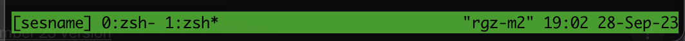
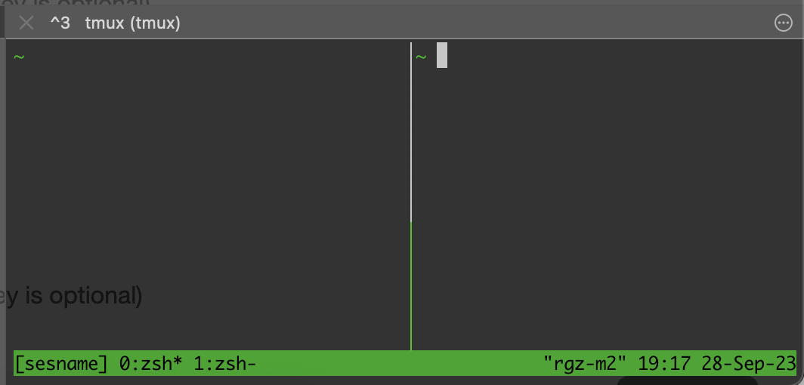
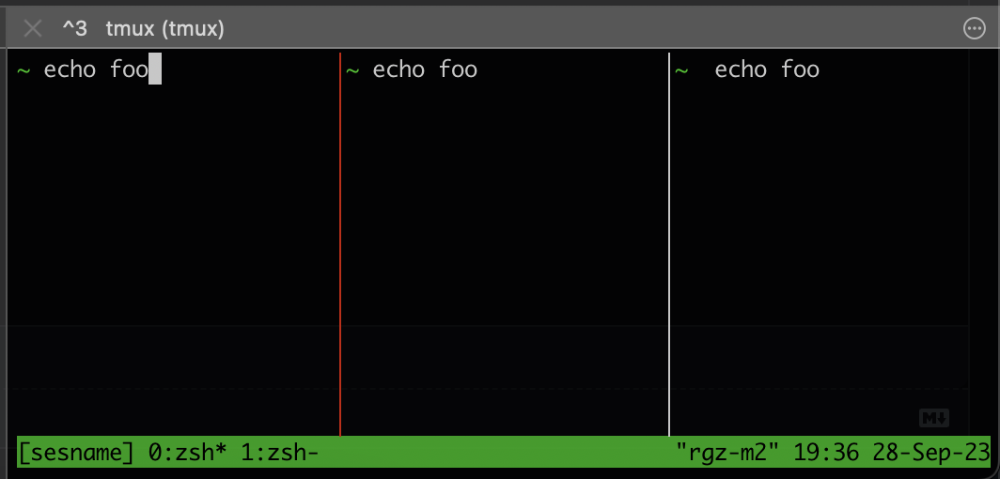
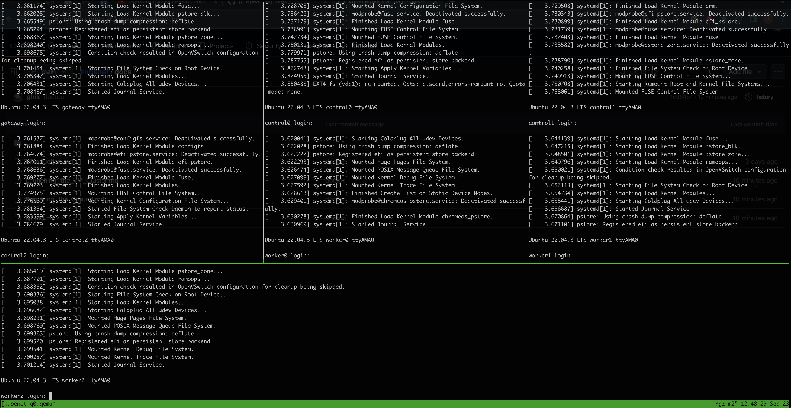

\[ **macOS/ARM64** | [Linux/AMD64](../../linux/docs/03_Launching_the_VM_Cluster.md) \]

Previous: [Preparing Environment for a VM Cluster](02_Preparing_Environment_for_a_VM_Cluster.md)

# Launching the VM Cluster

The network is configured, and we have all the VM images and configs prepared.
It's time to automate launching an entire cluster of VMs.

<!-- START doctoc generated TOC please keep comment here to allow auto update -->
<!-- DON'T EDIT THIS SECTION, INSTEAD RE-RUN doctoc TO UPDATE -->
**Table of Contents**  *generated with [DocToc](https://github.com/thlorenz/doctoc)*

- [Prerequisites](#prerequisites)
- [Granting resources](#granting-resources)
- [VM launching script](#vm-launching-script)
- [`tmux` crash course](#tmux-crash-course)
  - [Basic `tmux` controls](#basic-tmux-controls)
  - [Commands and shortcuts](#commands-and-shortcuts)
  - [Configuration and customization](#configuration-and-customization)
  - [Working with panes](#working-with-panes)
    - [Splitting panes](#splitting-panes)
    - [Switching between panes](#switching-between-panes)
    - [Zooming a pane](#zooming-a-pane)
    - [Synchronizing panes](#synchronizing-panes)
  - [Detaching and attaching](#detaching-and-attaching)
  - [Scriptability](#scriptability)
- [Using `tmux` to launch and connect to the cluster](#using-tmux-to-launch-and-connect-to-the-cluster)
  - [A script to launch them all](#a-script-to-launch-them-all)
  - [Connecting with SSH](#connecting-with-ssh)
- [Summary](#summary)
- [Resources](#resources)

<!-- END doctoc generated TOC please keep comment here to allow auto update -->

## Prerequisites

Make sure you have all the necessary [packages](00_Introduction.md#software) installed, and that you have completed
the [previous chapter](02_Preparing_Environment_for_a_VM_Cluster.md).

## Granting resources

So far we have been using 2 virtual CPUs and 2GB of RAM when launching a VM for testing. Let's properly decide
the amount of resources every VM gets, based on its purpose:
* the `gateway` and `control` VM don't do heavy work, so we give them 2 vCPUs and 2GB of RAM
* `worker` nodes need more muscle - let's give them 4 vCPUs and 4GB of RAM

This amounts to a total of 20GB of RAM for all the VMs. If you have some more to spare, you can increase
the amount of RAM granted to workers.

## VM launching script

Let's automate launching a single VM with a `vmlaunch.sh` script.
The script takes VM ID as an argument.

```bash
#!/usr/bin/env bash
set -xe
dir=$(dirname "$0")

# Grab the helpers
source "$dir/helpers.sh"

# Parse the argument (VM ID)
vmid=$1
vmname=$(id_to_name "$vmid")
vmdir="$dir/$vmname"

# Assign resources
case "$vmname" in
  gateway|control*)
    vcpus=2
    memory=2G
    ;;
  worker*)
    vcpus=4
    memory=4G
    ;;
esac

# Compute the MAC address
mac="52:52:52:00:00:0$vmid"

# Launch the VM
qemu-system-aarch64 \
    -nographic \
    -machine virt,accel=hvf,highmem=on \
    -cpu host \
    -smp $vcpus \
    -m $memory \
    -bios "/opt/homebrew/share/qemu/edk2-aarch64-code.fd" \
    -nic vmnet-shared,start-address=192.168.1.1,end-address=192.168.1.20,subnet-mask=255.255.255.0,"mac=$mac" \
    -hda "$vmdir/disk.img" \
    -drive file="$vmdir/cidata.iso",driver=raw,if=virtio
```

Give it executable permissions and test it on the `gateway` VM:

```
./vmsetup.sh 0
sudo ./vmlaunch.sh 0
```

## `tmux` crash course

> [!NOTE]
> This subchapter is intended for people that have never worked with `tmux` (or very little).
> You can go straight to [using `tmux` to launch the cluster](#using-tmux-to-launch-and-connect-to-the-cluster) if
> you don't need this introduction.

We're about to launch multiple VMs at once, using pure command line tools. In order to make this more
manageable, we'll use [`tmux`](https://github.com/tmux/tmux/wiki).

Quoting the `tmux` wiki:
> tmux is a terminal multiplexer. It lets you switch easily between several programs in one terminal,
> detach them (they keep running in the background) and reattach them to a different terminal.

More specifically, `tmux` will give us the fillowing powers:
* to launch multiple shells inside a single terminal-based application (in a _session_)
* to detach a running session from the current terminal (make it run fully in background) and reattach it later in any other terminal
* to execute something simultaneously in multiple shells (i.e. on multiple VMs), using _pane synchronization_

### Basic `tmux` controls

Independent runs of `tmux` are called _sessions_. Sessions can have multiple _windows_ - they behave a bit like tabs.
Finally, a window can have multiple _panes_ - simultaneously visible split-screen shells.

Let's try it out. Start a new session with:

```bash
tmux new -s sesname
```

This creates a session named `sesname` and attaches it to current terminal. You should see something like this:


A session initially has a single window with a single pane running a new shell.

### Commands and shortcuts

`tmux` can be contolled with a multitude of commands and configuration options (much like, for example, `vim`).
These commands can be issued internally (from within a session) or externally (from any terminal).

In order to execute a command from within a session, hit `Ctrl`+`b`, then
type a colon (`:`) followed by the command itself. For example, `Ctrl`+`b`, `:new-window` creates a new window.
You can see the new window listed in the status bar:



The asterisk (`*`) indicates the active window (the newly created one). One of many ways to switch
between windows is to use `:next-window` and `:previous-window` commands.

Typing commands just to navigate between windows and panes would be very tedious. Not surprisingly, many commands
have a built-in keyboard shortcut. For example, `:next-window` and `:previous-window` command have corresponding
`Ctrl`+`b`,`n` and `Ctrl`+`b`,`p` shortcuts. You can also use `Ctrl`+`b`,\<window-number\> to switch windows by numbers.

> [!NOTE]
> `Ctrl`+`b` is called the _prefix_, and it precedes every keyboard shortcut.

There are several online resources you can use to explore the vastness of `tmux` capabilities.
For example, [here's a cheatsheet](https://tmuxcheatsheet.com/) with the most essential shortcuts.

### Configuration and customization

Not surprisingly, `tmux` can be heavily customized. You can create new commands, change shortcuts, assign new shortcuts,
etc. In order to do this for your current user, create the `~/.tmux.conf` file. It works in the same spirit as "rc" 
files used by many essential Unix tools (e.g. `.bashrc`, `.vimrc`, etc.).

For this tutorial, I found it useful to have the following entries in my `~/.tmux.conf`:

```
set -g mouse on
bind C-s setw synchronize-panes
```

* `set -g mouse on` makes `tmux` behave more like a typical graphical application; it allows us to perform several
   actions with mouse clicks or drags (e.g. switching windows and panes)
* `bind C-s setw synchronize-panes` assigns a keyboard shortcut to the `setw synchronize-panes`, which we'll explain
  in a moment

### Working with panes

Let's see some panes in action.

#### Splitting panes

Hit `Ctrl`+`b`,`%` to split the current pane vertically into two panes laid out
side by side.



Do it multiple times to create more panes. You can then move and resize panes, using plethora of commands and
shortcuts offered by `tmux`. However, chances are you'll be happy with one of the built-in layouts.
Hit `Ctrl`+`B`,`spacebar` multiple times to switch between them (e.g. all vertical, all horizontal, mixed, etc.).
This is an easy way to evenly split available space between panes.

#### Switching between panes

Switching between panes can also be done in multiple ways. For example, if you hit `Ctrl`+`b`,`q`, pane numbers will 
be temporarily highlighted. While they are highlighted, hit the desired pane number in order to switch to it.
With the `set -g mouse on` option, we can also switch panes with simple mouse clicks.

#### Zooming a pane

Here's a command that's very useful when you want to focus on a single pane: `Ctrl`+`b`,`z` (zoom). 
It causes the current pane to temporarily enter "fullscreen". The same shortcut is used to toggle the zoom off.

#### Synchronizing panes

Finally, the command that makes `tmux` stand for its name: `:setw synchronize-panes`. It causes all keystrokes to
be sent to **all panes** in the current window, simultaneously. The same command toggles the synchronization off.
In the previous section, we have also given it a keyboard shortcut: `Ctrl`+`b`,`Ctrl`+`s`.

When panes are synchronized, current panel highlight color changes from green to red:



We'll use pane synchronization in practice to configure multiple VMs at once.

### Detaching and attaching

A running `tmux` session can be detached from current terminal and brought into background. The shortcut is `Ctrl`+`b`,`d`.
You can then reattach it to any terminal using the command:

```
tmux attach -t sesname
```

(`sesname` is our session name)

### Scriptability

As mentioned earlier, `tmux` can be controlled from outside. You can send commands to it from any terminal in your system.
This works even if a `tmux` session is detached, and it allows us to fully automate interactions. For example, we can write
a script that creates a session with 3 windows, splits each into 4 separate panes, and applies a particular layout to them.

Here's an example of a command being sent to a running `tmux` session from outside:

```
tmux split-window -v -t sesname
```

## Using `tmux` to launch and connect to the cluster

We now know enough about `tmux` to use it for our purpose: to launch all the VMs and connect to them with SSH.

We will launch 2 tmux sessions:
* One to run all the VMs, one machine per pane, in a single window. It will run detached and with elevated
  privileges.
* One for SSH connections to all the VMs. This session will have several windows:
  * a window for an SSH connection to the `gateway` VM
  * a window for SSH connections to `control` VMs (3 panes)
  * a window for SSH connections to `worker` VMs (3 panes)
  * a window for SSH connections to both `control` and `worker` VMs (6 panes)

The reason why we're splitting SSH connections into 4 separate windows is because we're going to do different
things with every VM type. For example, we'll need to configure some things on all control nodes.
Then, we'll need to do something else on all worker nodes. Finally, we'll need to perform some actions on _both_ control
and worker nodes, simultaneously.

> [!NOTE]
> We must also launch two separate sessions because:
> * launching VMs requires elevated privileges while SSH must be invoked by the current user
> * the VMs (QEMU) should rarely require interaction, so the QEMU session may run in detached mode
>   while the SSH session can be launched independently

Using `tmux`'s scriptability, we'll automate all of the above with shell scripts.

### A script to launch them all

`vmlaunchall.sh` is the script that launches all the VMs in a `tmux` session:

```bash
#!/usr/bin/env bash
set -xe
dir=$(dirname "$0")

# Grab the helpers
source "$dir/helpers.sh"

# The script takes tmux session name as an argument
sname=$1
if [[ -z $sname ]]; then
  echo "usage: $(basename "$0") <tmux-session-name>"
  exit 1
fi

# Launch a tmux session (with initial window named `qemu`) and immediately detach from it
tmux new-session -s "$sname" -n qemu -d

# Split the first window into 7 panes and launch a VM in each one
for vmid in $(seq 0 6); do
  tmux send-keys -t "$sname" "cd $dir" C-m
  tmux send-keys -t "$sname" "vmid=$vmid; vmname=$vmname" C-m
  tmux send-keys -t "$sname" './vmlaunch.sh $vmid' C-m
  if [[ $vmid != 6 ]]; then
    tmux split-window -t "$sname" -v
  fi
  tmux select-layout -t "$sname" tiled
done
```

Save it with executable permissions. Then make sure all the VMs are prepared for launch:

```bash
for vmid in $(seq 0 6); do 
  ./vmsetup.sh $vmid
done
```

Finally, the moment of truth. Launch the cluster 🚀:

```bash
sudo ./vmlaunchall.sh kubenet-qemu
```

The script leaves the `tmux` session detached. If you would like to watch your VMs starting up,
reattach it with:

```bash
sudo tmux attach -t kubenet-qemu
```

Ultimately, you should see something like this:



You can detach with `Ctrl`+`b`,`d`.

You can also kill the session (along with all the VMs) using:

```bash
sudo tmux kill-session -t kubenet-qemu
```

### Connecting with SSH

The second script, `vmsshall.sh`, automates initiating SSH connections to all the VMs:

```bash
#!/usr/bin/env bash
set -xe
dir=$(dirname "$0")

# Grab the helpers
source "$dir/helpers.sh"

# The script takes tmux session name as an argument
sname=$1
if [[ -z $sname ]]; then
  echo "usage: $(basename "$0") <tmux-session-name>"
  exit 1
fi

# Wait for VMs to start up and expose their SSH port. Scan their keys and add them to known_hosts.
for vmid in $(seq 0 6); do
  "$dir/vmsshsetup.sh" $vmid
done

# A function that prepares a pane for connecting to a VM with SSH, and connects to it.
# Takes VM ID as an argument.
vm_ssh() {
  local vmid=$1
  local vmname=$(id_to_name "$vmid")
  tmux send-keys -t "$sname" "ssh ubuntu@$vmname" C-m
}

# Launch a new session with initial window named "ssh-gateway"
tmux new-session -s "$sname" -n ssh-gateway -d
# Connect to `gateway` VM
vm_ssh 0

ssh_window() {
  local window_name=$1
  local first_vmid=$2
  local last_vmid=$3
  local layout=$4

  tmux new-window -t "$sname" -n "$window_name"
  for vmid in $(seq "$first_vmid" "$last_vmid"); do
    vm_ssh "$vmid"
    if [[ "$vmid" != "$last_vmid" ]]; then
      tmux split-window -t "$sname" -v
    fi
    tmux select-layout -t "$sname" "$layout"
  done
}

# Create a window with SSH connections to `control` VMs
ssh_window ssh-controls 1 3 even-vertical

# Create a window with SSH connections to `worker` VMs
ssh_window ssh-workers 4 6 even-vertical

# Create a window with SSH connections to both `control` and `worker` VMs
ssh_window ssh-nodes 1 6 tiled

# Finally, attach the session back to the current terminal and activate the second window
tmux attach -t "$sname:ssh-controls"
```

Save it with executable permissions and try it out:

```bash
./vmsshall.sh kubenet-ssh
```

This should bring up a `tmux` session with all the SSH connections already established.

And this is it! After much learning and scripting, the VM cluster is finally running 🎉

## Summary

In this chapter, we have:
* automated launching a single VM with a script
* learned how to use `tmux`
* automated launching the entire cluster in a `tmux` session
* automated connecting to VMs with SSH in a multi-window `tmux` session

## Resources

1. [Getting started with `tmux`](https://linuxize.com/post/getting-started-with-tmux/)
2. [Tmux Cheat Sheet & Quick Reference](https://tmuxcheatsheet.com/)

Next: [Bootstrapping Kubernetes Security](04_Bootstrapping_Kubernetes_Security.md)
